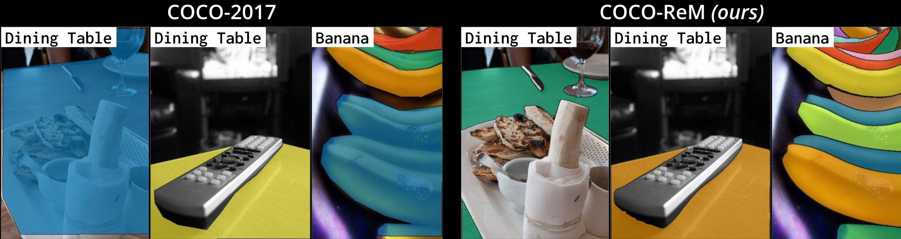

# COCO-ReM (COCO with Refined Masks)

[](https://pytorch.org) [](https://huggingface.co/datasets/kdexd/coco-rem)

[Shweta Singh](https://www.linkedin.com/in/shweta-singh-460154284/)<sup>&dagger;</sup>, [Aayan Yadav](https://www.linkedin.com/in/aayanyadav09/)<sup>&dagger;</sup>, [Jitesh Jain](https://praeclarumjj3.github.io/), [Humphrey Shi](https://www.humphreyshi.com/home), [Justin Johnson](https://web.eecs.umich.edu/~justincj/), [Karan Desai](https://kdexd.xyz/) 

<sup>&dagger;</sup> Equal Contribution

[[`arxiv`](https://arxiv.org/abs/2403.18819)] [[`Dataset Website`](https://cocorem.xyz)]



Introducing COCO-ReM, a set of high-quality instance annotations for COCO images.
COCO-ReM improves on imperfections prevailing in COCO-2017 such as coarse mask boundaries, non-exhaustive annotations,
inconsistent handling of occlusions, and duplicate masks.
Masks in COCO-ReM have a visibly better quality than COCO-2017, as shown below.


## Contents

1. [News](#news)
2. [Setup Instructions](#setup-instructions)
3. [Download COCO-ReM](#download-coco-rem)
4. [Mask Visualization](#mask-visualization)
5. [Evaluation using COCO-ReM](#evaluation-using-coco-rem)
6. [Training with COCO-ReM](#training-with-coco-rem)
7. [Annotation Pipeline](#annotation-pipeline)
    - [Stage 1: Mask Boundary Refinement (automatic step)](#stage-1-mask-boundary-refinement)
    - [Stage 2: Exhaustive Instance Annotation (automatic step)](#stage-2-exhaustive-instance-annotation)
    - [Stage 3: Correction of Labeling Errors](#stage-3-correction-of-labeling-errors)
8. [Citation](#citation)

## News

- **[July 7, 2024]**: Dataset now available on [**HuggingFace**](https://huggingface.co/datasets/kdexd/coco-rem) and [**code**](https://github.com/kdexd/coco-rem) is public!
- **[July 1, 2024]**: COCO-ReM is accepted to ECCV 2024!
- **[March 27, 2024]**: [**Dataset website**](https://cocorem.xyz) and [**arXiv preprint**](https://arxiv.org/abs/2403.18819) are public!

## Setup Instructions

Clone the repository, create a conda environment, and install all dependencies as follows:

```bash
git clone https://github.com/kdexd/coco-rem.git && cd coco-rem
conda create -n coco_rem python=3.10
conda activate coco_rem
```

Install PyTorch and `torchvision` following the instructions on [pytorch.org](https://pytorch.org).
Install Detectron2, [instructions are available here](https://github.com/facebookresearch/detectron2/blob/main/INSTALL.md).
Then, install the dependencies:

```bash
pip install -r requirements.txt
pip install git+https://github.com/facebookresearch/segment-anything.git
pip install git+https://github.com/bowenc0221/boundary-iou-api.git

python setup.py develop
```

## Download COCO-ReM

COCO-ReM is hosted on Huggingface Datasets at [@kdexd/coco-rem](https://huggingface.co/datasets/kdexd/coco-rem).
Download the annotation files:

```
for name in trainrem valrem; do
    wget https://huggingface.co/datasets/kdexd/coco-rem/resolve/main/instances_$name.json.zip
    unzip instances_$name.json.zip
done
```

**Dataset organization:** COCO and COCO-ReM and must be organized inside `datasets` directory as follows.

```
$PROJECT_ROOT/datasets
    — coco/
        — train2017/         # Contains 118287 train images (.jpg files).
        — val2017/           # Contains 5000 val images (.jpg files).
        — annotations/
            — instances_train2017.json
            — instances_val2017.json
    - coco_rem/
            - instances_trainrem.json
            - instances_valrem.json
    -lvis
            - lvis_v1_val.json
            - lvis_v1_train.json
```

-----

## Mask Visualization

We include a lightweight script to quickly visualize masks of COCO-ReM and COCO-2017,
both validation and training sets. For example, run the following command to visualize
the masks for COCO-ReM validation set:

```bash
python scripts/visualize_coco.py \
    --input-json datasets/coco_rem/instances_valrem.json \
    --image-dir datasets/coco/val2017 \
    --output visualization_output
```

Read the documentation (`python scripts/visualize_coco.py --help`) for details about other arguments.

-----

## Evaluation using COCO-ReM

We support evaluation of all fifty object detectors available in the paper.
First, run `python checkpoints/download.py` to download all the pre-trained models
from their official repositories and save them in `checkpoints/pretrained_weights`.

For example, to evaluate a [Mask R-CNN ViTDet-B model](https://arxiv.org/abs/2203.16527) using 8 GPUs
and calculate average precision (AP) metrics, run the following command:

```bash
python scripts/train_net.py --num-gpus 8 --eval-only \
    --config coco_rem/configs/vitdet/mask_rcnn_vitdet_b_100ep.py \
    train.init_checkpoint=checkpoints/pretrained_weights/vitdet/mask_rcnn_vitdet_b_100ep.pkl \
    dataloader.test.dataset.names=coco_rem_val \
    train.output_dir=evaluation_results
```

## Training with COCO-ReM

We also support training ViTDet baselines on COCO-ReM using the Detectron2 library.
Run the following command to train using 8 GPUs (with at least 32GB memory):

```bash
python scripts/train_net.py --num-gpus 8 \
    --config coco_rem/configs/vitdet/mask_rcnn_vitdet_b_100ep.py \
    dataloader.train.dataset.names=coco_rem_train \
    dataloader.test.dataset.names=coco_rem_val \
    train.output_dir=training_output \
    dataloader.train.total_batch_size=16 train.grad_accum_steps=4
```

For GPUs with less memory, update the parameters in the last line above:
the batch size can be halved and gradient accumulation steps can be doubled, for same results.

## Annotation Pipeline

<a id="stage-1-mask-boundary-refinement"></a>
### Stage 1: Mask Boundary Refinement (automatic step)

Download checkpoint for SAM from [segment-anything repository](https://github.com/facebookresearch/segment-anything) and place it in `checkpoint` folder.

Run the following command to refine the boundaries of validation set masks using 8 GPUs:

```bash
python scripts/refine_boundaries.py \
    --input-json datasets/coco/annotations/instances_val2017.json \
    --image-dir datasets/coco/val2017 \
    --num-gpus 8 \
    --output datasets/intermediate/cocoval_boundary_refined.json
```

Read the documentation (`python scripts/refine_boundaries.py --help`) for details about other arguments.

Use default values for other optional arguments to follow the strategy used in [paper](https://arxiv.org/abs/2403.18819). 

Do this stage for both COCO and LVIS datasets before the merging stage.

<a id="stage-2-exhaustive-instance-annotation"></a>

### Stage 2: Exhaustive Instance Annotation (automatic step)

Run the following command to merge LVIS annotations for validation set of COCO using the strategy described in  [paper](https://arxiv.org/abs/2403.18819):

```
python scripts/merge_instances.py \
    --coco-json datasets/intermediate/cocoval_boundary_refined.json \
    --lvis-json datasets/intermediate/lvistrain_boundary_refined.json datasets/intermediate/lvisval_boundary_refined.json \
    --split val \
    --output datasets/intermediate/cocoval_lvis_merged.json
```
Read the documentation (`python scripts/merge_instances.py --help`) for details about above arguments.

Merging handpicked `(image,category)` non exhaustive instances from LVIS in validation set is done in the script of next stage.

<a id="stage-3-correction-of-labeling-errors"></a>

### Stage 3: Correction of Labeling Errors

This stage is done only for validation set.

```
python scripts/correct_labeling_errors.py \
    --input datasets/intermediate/cocoval_lvis_merged.json \
    --output datasets/cocoval_refined.json
```
**Note**: For the above json to be COCO-ReM we also have to perform the manual parts of Stage 1 and Stage 2.

## Citation

If you found COCO-ReM useful in your research, please consider starring ⭐ us on GitHub and citing 📚 us in your research!

```bibtex
@inproceedings{cocorem,
  title={Benchmarking Object Detectors with COCO: A New Path Forward},
  author={Singh, Shweta and Yadav, Aayan and Jain, Jitesh and Shi, Humphrey and Johnson, Justin and Desai, Karan},
  journal={ECCV},
  year={2024}
}
```
