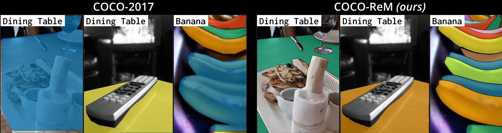
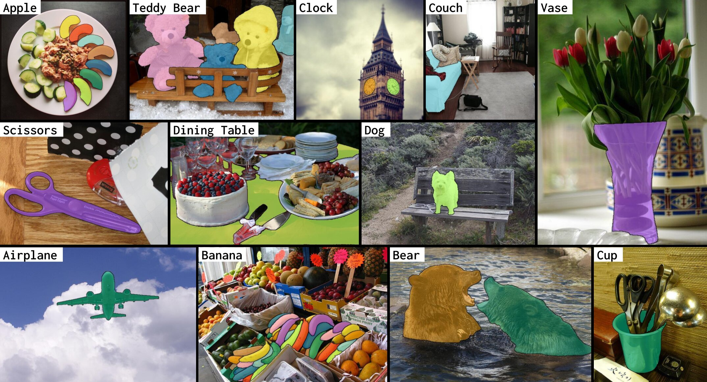

# COCO-ReM (COCO with Refined Masks)

[[Paper](https://arxiv.org/abs/2403.18819)] [[Website](https://cocorem.xyz)]

Introducing COCO-ReM, a set of high-quality instance annotations for COCO images.
COCO-ReM improves on imperfections prevailing in COCO-2017 such as coarse mask boundaries, non-exhaustive annotations, inconsistent handling of occlusions, and duplicate masks.
Masks in COCO-ReM have a visibly better quality than COCO-2017, as shown below.

### Annotations are available on our website.
### Training and Evaluating code: coming soon!
